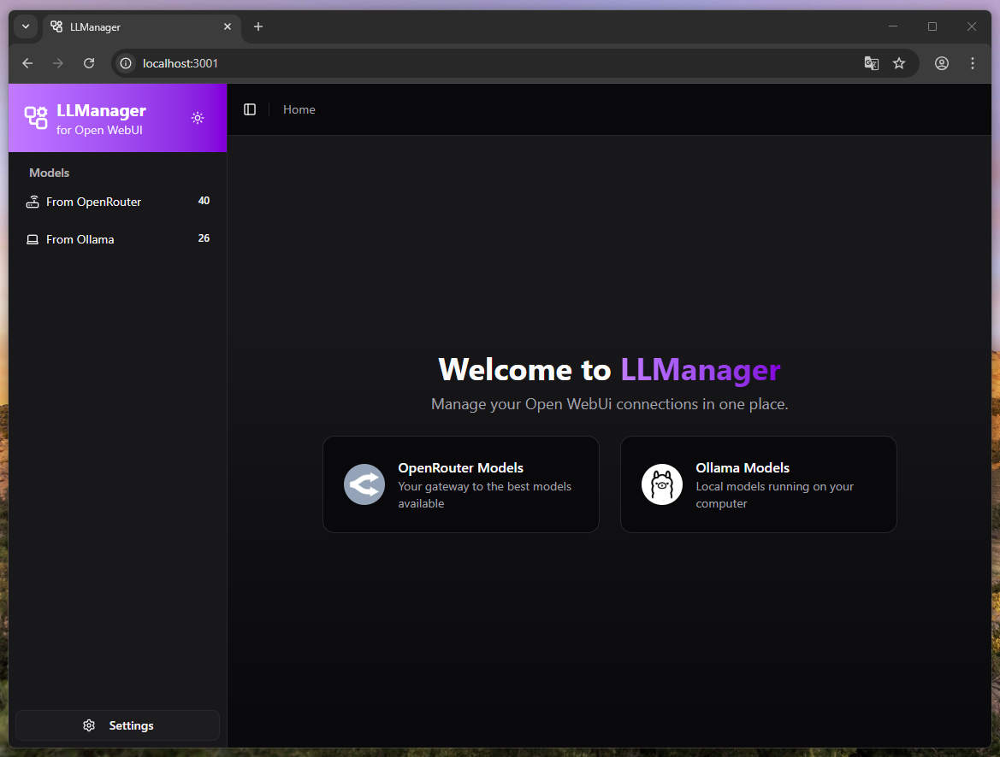
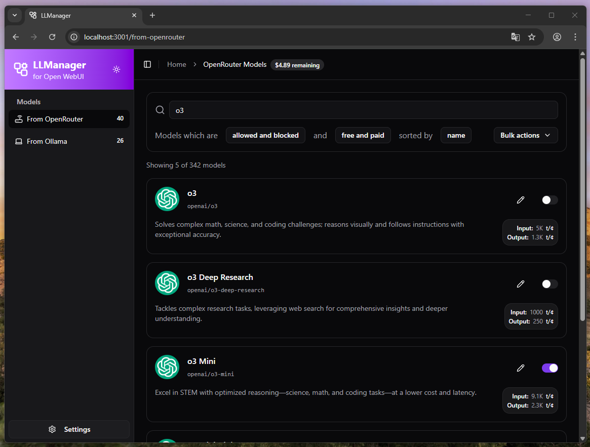
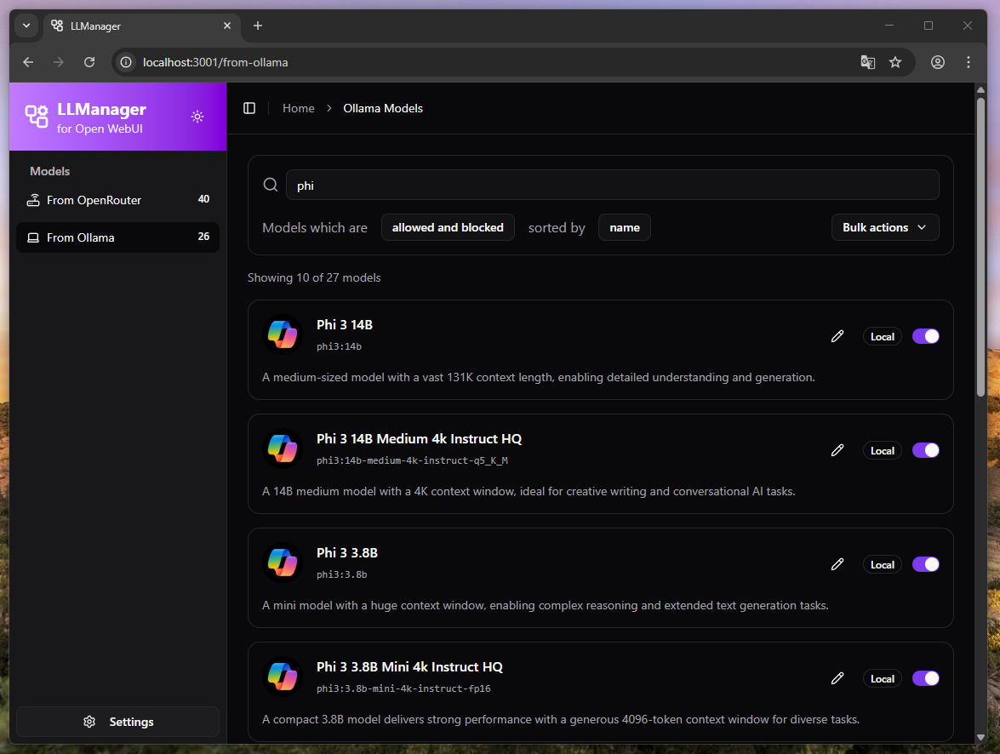

# LLManager

LLManager is a full-stack application designed to optimize your experience with Open WebUI by managing connections to OpenRouter and Ollama. It addresses the performance issues caused by loading 300+ models in Open WebUI by allowing you to selectively enable only the models you need.

## Features

- **Selective Model Management**: Enable or disable specific models to reduce clutter and improve frontend's performance in Open WebUI.
- **Provider Support**: Seamlessly integrates with both OpenRouter and Ollama.
- **Automated Metadata**: Automatically generates descriptions for OpenRouter & Ollama models using ✨ Generative AI.
- **Smart Naming**: Intelligent name generation for Ollama models for better readability.
- **Visual Identity**: Fetches and displays model profile pictures using `extended-lobe-icons`.
- **Programmatic API**: Robust API for external integrations and automation.
- **Secure Authentication**: Protects your management interface with password-based authentication.

## Screenshots

### Dashboard


### OpenRouter Integration


### Ollama Integration


## Tech Stack

- **Runtime**: [Bun](https://bun.sh)
- **Frontend**: React, TailwindCSS, Biome
- **Backend**: Bun, SQLite
- **Icons**: Lucide React, extended-lobe-icons

## Getting Started

### Prerequisites

- [Bun](https://bun.sh)

### Installation

1.  Clone the repository:
    ```bash
    git clone https://github.com/NotJustAnna/llmanager.git
    cd llmanager
    ```

2.  Install dependencies:
    ```bash
    bun install
    ```

3.  Set up environment variables:
    Copy `.env.example` to `.env` and configure your settings.
    ```bash
    cp .env.example .env
    ```

### Development

To start the development server with hot reloading:

```bash
bun dev
```

### Production

To build and run the application for production:

1.  Build the project:
    ```bash
    bun run build
    ```

2.  Start the server:
    ```bash
    ./llmanager
    ```
